# P2_Probstat_D_5025201206

## Soal 1

### 1a

Standar Deviasi didapatkan

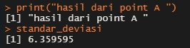

### 1b

nilai t (p-value) didapatkan

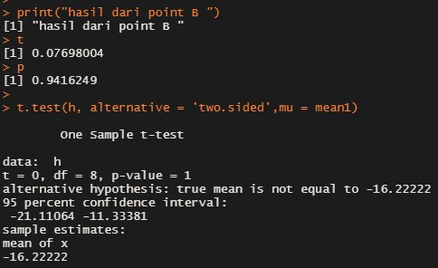

## Soal 2

Setelah mencari null hipostesis dan alternatif hipostatis
kemudian dapatkan Z

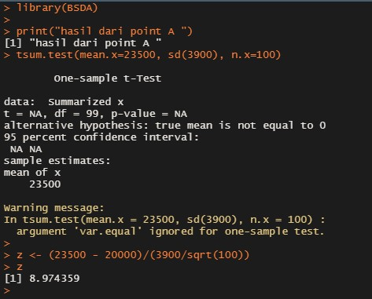

## Soal 3

### 3a
Dapatkan nilai dari H0 dan H1

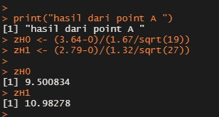

### 3b
Hitungan sampel statistik

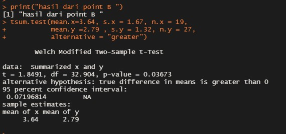

### 3c
Hasil uji statistik dengan df = 2

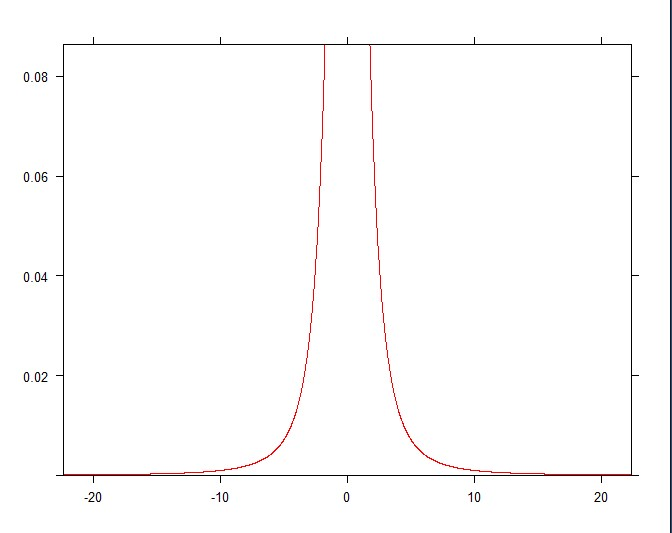

### 3d
Hasil hitung nilai Kritikal

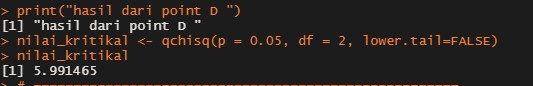

## Soal 4
Hasil memberi nama kategori berdasarkan V1 kemudian dikelompokkan berdasarkan grup kucing

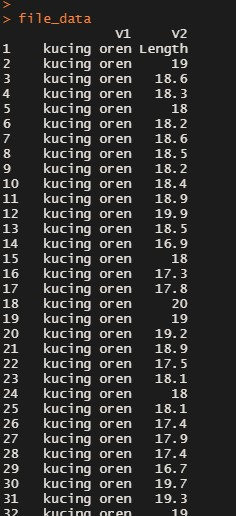

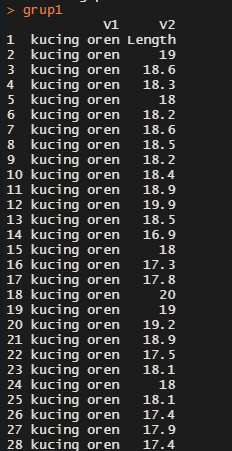

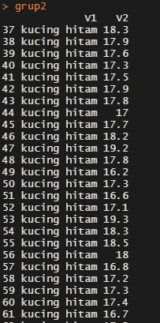

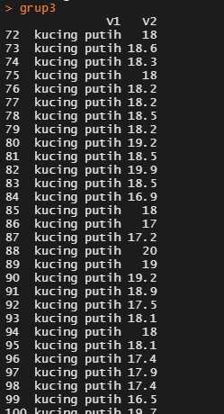
